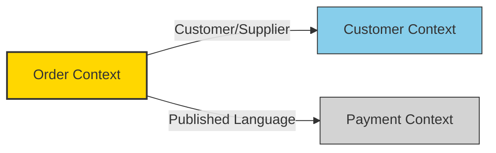
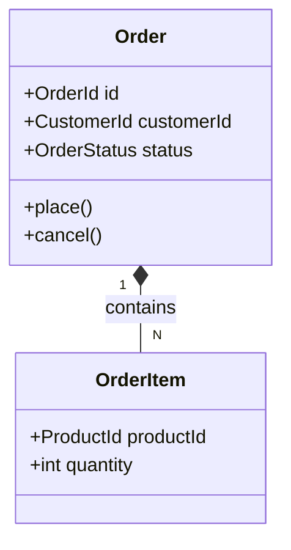
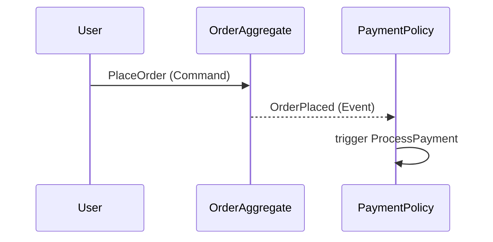

# Mermaid 図のテンプレート集

SKILL.md 手順3〜4 で使用する Mermaid 記述例。

## Context Map（Bounded Context 間の関係）



### スタイル定義

- Core Domain: 金色 `fill:#FFD700`
- Supporting Domain: 水色 `fill:#87CEEB`
- Generic Domain: グレー `fill:#D3D3D3`

### エッジ（関係）のラベル例

- `-->|Customer/Supplier|`
- `-->|Conformist|`
- `-->|Published Language|`
- `-->|Anti-Corruption Layer|`
- `-->|Shared Kernel|`

## Aggregate 構造図（クラス図形式）



## イベントフロー図（シーケンス図形式）



## コミットメッセージ例

```text
docs: ドメインモデル図（Context Map）の追加

- Bounded Context 間の関係を Mermaid 図で視覚化
- 戦略的分類に基づく色分けを追加
```
