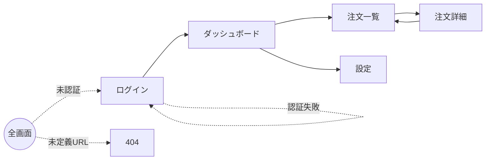

# 画面定義と遷移図テンプレート

SKILL.md 手順3〜5 で使用する画面一覧・遷移図・レスポンシブ方針のテンプレート。

## 画面一覧テーブル

| 画面ID | 名称 | URL | アクセス権限 | 主な状態 |
|:--|:--|:--|:--|:--|
| SCR-001 | ログイン | `/login` | 未認証 | 入力・認証中・エラー |
| SCR-002 | ダッシュボード | `/` | 認証済み | 初回（Empty）・通常・ロード中 |
| SCR-003 | 注文一覧 | `/orders` | 認証済み | 0件・一覧・ページング |
| SCR-004 | 注文詳細 | `/orders/:id` | 認証済み・本人 | 通常・取消済み・エラー |
| SCR-005 | 設定 | `/settings` | 認証済み | タブ別 |
| SCR-999 | 404 | `/*` | 全員 | デフォルト |

## 重要な状態の観点

- **Empty State**: データが 0 件、初回訪問時
- **Loading State**: 非同期取得中
- **Error State**: 取得失敗、権限不足、タイムアウト
- **Success State**: 操作成功後のフィードバック

## 画面遷移図（Mermaid）



- デッドエンド（戻れない画面）がないか確認する。
- エラーや未認証時のリダイレクト先を明示する。

## レスポンシブデザインポリシー

### ブレークポイント（Tailwind 基準）

| 名称 | 幅 | 主な対象 |
|:--|:--|:--|
| sm | 640px〜 | モバイル横 |
| md | 768px〜 | タブレット縦 |
| lg | 1024px〜 | タブレット横・小型ノート |
| xl | 1280px〜 | デスクトップ |
| 2xl | 1536px〜 | 大型ディスプレイ |

### 方針

- **モバイルファースト**で設計する（Tailwind のデフォルト）
- メニュー: モバイル=ハンバーガー / デスクトップ=サイドバー
- データテーブル: モバイル=カードレイアウト / デスクトップ=テーブル
- モーダル: モバイル=フルスクリーン / デスクトップ=中央配置

## コミットメッセージ例

```text
docs: 画面設計ドキュメントの作成

- 画面一覧と遷移フロー（Mermaid）を追加
- レスポンシブデザインポリシーを定義
```
