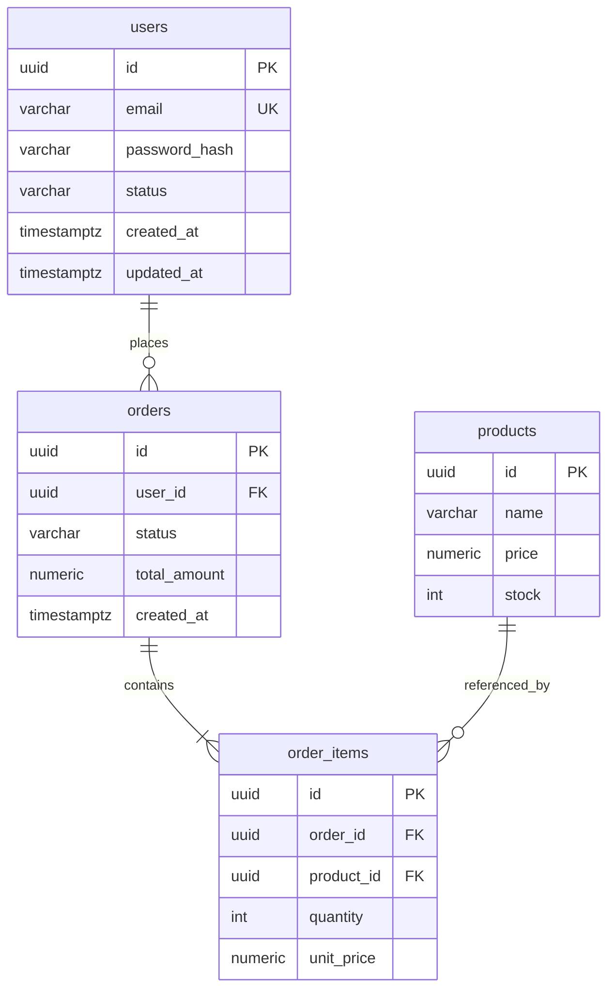

# エンティティ定義と ERD テンプレート

SKILL.md 手順3〜5 で使用するエンティティ記述・リレーション・ERD のサンプル。

## エンティティ一覧テーブル

| 物理名 | 論理名 | 対応 Aggregate | 説明 |
|:--|:--|:--|:--|
| users | ユーザー | User | 認証・プロフィール |
| orders | 注文 | Order | 注文ヘッダ |
| order_items | 注文明細 | Order (child) | 注文の商品行 |
| products | 商品 | Product | 商品マスタ |

## カラム定義テンプレート

### users テーブル

| カラム | 型 | 制約 | 説明 |
|:--|:--|:--|:--|
| id | UUID | PK | 主キー |
| email | VARCHAR(255) | NOT NULL, UNIQUE | ログイン ID |
| password_hash | VARCHAR(255) | NOT NULL | bcrypt ハッシュ |
| status | VARCHAR(20) | NOT NULL, DEFAULT 'active' | active / suspended |
| created_at | TIMESTAMPTZ | NOT NULL, DEFAULT NOW() | 作成日時 |
| updated_at | TIMESTAMPTZ | NOT NULL, DEFAULT NOW() | 更新日時 |

### 主キー戦略

| 戦略 | 適合シーン |
|:--|:--|
| Auto Increment | 単一 DB、連番の可読性重視 |
| UUID v4 | 分散環境、推測困難性 |
| UUID v7 / ULID | ソート可能な ID が必要 |
| CUID | 短く衝突しにくい ID |

## リレーションシップ定義例

- `users 1 : N orders` (FK: orders.user_id → users.id)
- `orders 1 : N order_items` (FK: order_items.order_id → orders.id, ON DELETE CASCADE)
- `products 1 : N order_items` (FK: order_items.product_id → products.id, ON DELETE RESTRICT)

### 外部キー削除動作の選択

- `CASCADE`: 親削除時に子も削除（注文明細など）
- `SET NULL`: 親削除時に NULL（オプション参照）
- `RESTRICT`: 子が存在すれば親削除不可（マスタデータ）

## Mermaid ERD 記述例



## インデックス戦略の例

- 検索頻度の高いカラム（`orders.user_id`, `orders.status`）に単純インデックス
- 一意性保証: `users.email` に UNIQUE
- 複合インデックス: `(user_id, created_at DESC)` で注文履歴の高速取得
- 全文検索用途は別途 pg_trgm / GIN 等を検討

## 意図的な非正規化の記録例

- `orders.total_amount`: 集計クエリの高速化のため、order_items の合計を冗長保持
- 更新時のトリガ or アプリ側計算を明記

## コミットメッセージ例

```text
docs: データモデル（ERD）の定義

- エンティティ、属性、リレーションシップを定義
- Mermaid による ER 図を追加
```
