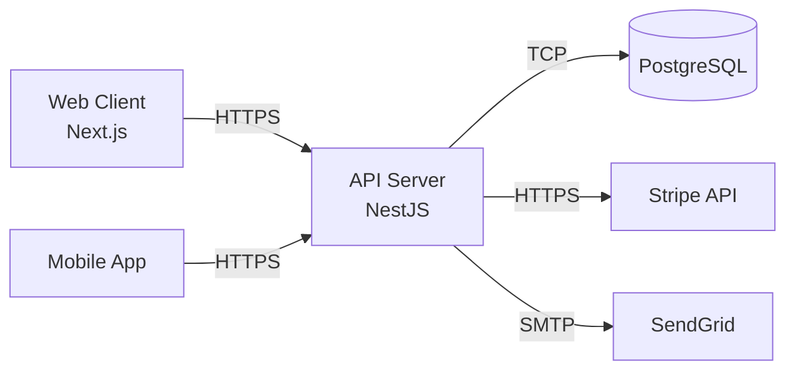
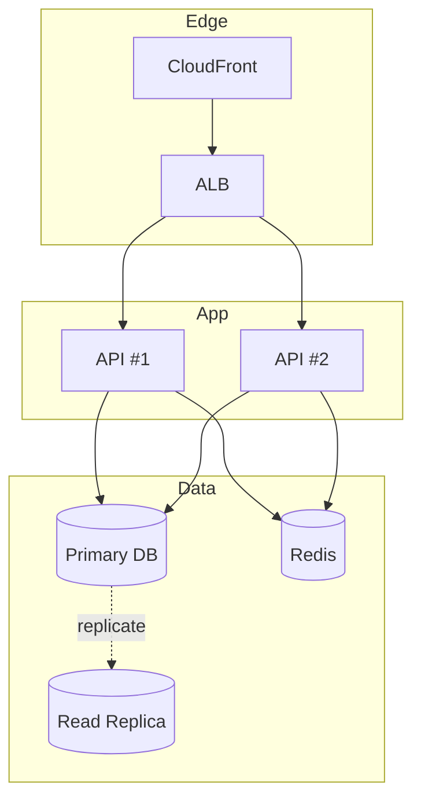

# アーキテクチャ図と ADR のテンプレート

SKILL.md 手順3〜5 で使用するシステム全体図と ADR のサンプル。

## システムアーキテクチャ図（Mermaid）

### シンプルな 3 層構成



### 冗長化・スケーリング構成



### 記述のポイント

- コンポーネント間のプロトコル（HTTPS / gRPC / TCP / SMTP）を矢印ラベルに記載
- スケールアウト対象（ALB 配下）を `subgraph` でグルーピング
- 外部サービス（Stripe 等）は独立ノードで明示

## アーキテクチャパターン選定ガイド

| パターン | 適合シーン |
|:--|:--|
| レイヤード | 標準的 Web アプリ、チーム規模小〜中 |
| クリーンアーキテクチャ | ドメインロジックが複雑、長期運用 |
| マイクロサービス | 組織/スケール境界が明確、独立デプロイ必須 |
| モジュラーモノリス | 将来分割したいが初期はモノリスで進めたい |
| Event-Driven | 非同期処理、拡張性重視 |

## ADR（Architecture Decision Record）テンプレート

```markdown
### ADR-001: データベースに PostgreSQL を採用

- **ステータス**: Accepted
- **日付**: YYYY-MM-DD

#### 背景（Context）

- トランザクション整合性と JSON 柔軟性の両立が必要
- チームの RDBMS 習熟度が高い

#### 決定（Decision）

- PostgreSQL 16 を採用

#### 代替案（Alternatives）

- MySQL 8: エコシステムは強いが JSON 機能が PG より弱い
- MongoDB: スキーマレスだが結合クエリでコード複雑化

#### 影響（Consequences）

- プラス: JSONB + リレーション、強い一貫性
- マイナス: 水平スケーリングに追加設計が必要（将来 Citus 等）
```

## よく記録する ADR の例

- DB 選定（RDBMS vs NoSQL）
- 認証方式（JWT vs Session vs OAuth）
- フロントエンドレンダリング（SPA vs SSR vs SSG）
- 非同期処理（Queue vs Event Bus vs 直接実行）
- フレームワーク選定
- キャッシュ戦略

## コミットメッセージ例

```text
docs: アーキテクチャ設計の定義

- システム全体図（Mermaid）の作成
- アーキテクチャパターンと ADR の記録
```
