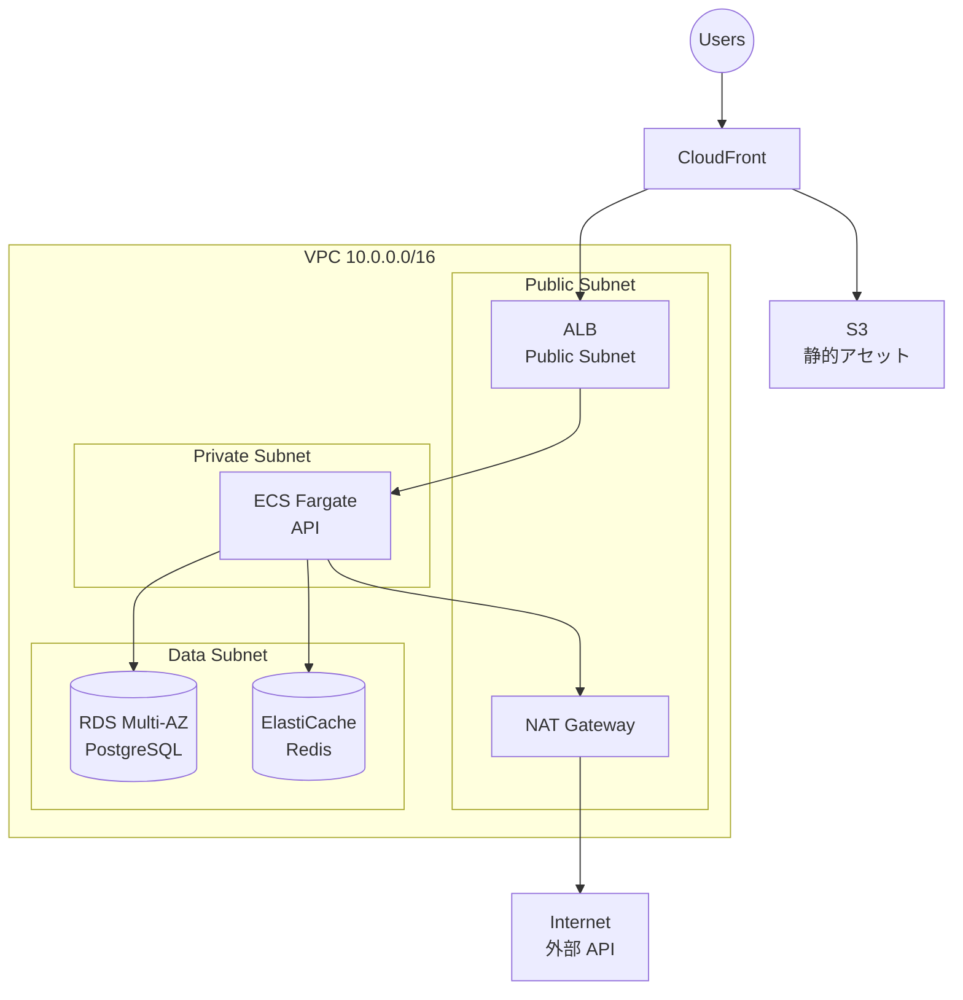

# インフラ構成図と環境構成のテンプレート

SKILL.md 手順3〜5 で使用するインフラ構成図・環境表・運用方針のサンプル。

## インフラ構成図（Mermaid）

### AWS 標準構成例



### 記述のポイント

- VPC / Subnet 階層を `subgraph` でグルーピング
- Public / Private / Data の分離を明示
- マネージドサービス（RDS, ElastiCache）はカッコ型ノード `[(...)]`

## 環境構成表

| 項目 | 開発 | ステージング | 本番 |
|:--|:--|:--|:--|
| API インスタンス | Fargate 0.25vCPU × 1 | Fargate 0.5vCPU × 1 | Fargate 1vCPU × 2 |
| DB | RDS t4g.micro Single-AZ | RDS t4g.small Single-AZ | RDS m7g.large Multi-AZ |
| リードレプリカ | なし | なし | 1 台 |
| キャッシュ | なし | ElastiCache t4g.micro | ElastiCache t4g.small × 2 |
| WAF | 無効 | 有効 | 有効 |
| バックアップ | 1 日保持 | 3 日 | 30 日 + 週次スナップショット |
| 監視アラート | Slack 低頻度 | Slack | Slack + PagerDuty |

## 運用方針の定義項目

### ネットワーク・セキュリティ

- VPC 構成、サブネット CIDR、AZ 配置
- セキュリティグループ方針（最小権限）
- WAF ルール、Rate Limit
- HTTPS 化（ACM / Let's Encrypt）
- Bastion / SSM Session Manager 経由のアクセス

### コンピューティングとスケーリング

- インスタンス種別（Fargate / EC2 / Cloud Run）
- Auto Scaling ポリシー（CPU 70%、ALB RequestCount）
- デプロイ戦略（Blue/Green、Rolling）

### データベースとストレージ

- Multi-AZ の有無
- リードレプリカ構成
- バックアップ: 自動（日次、保持期間）、手動スナップショット
- ポイントインタイムリカバリ（PITR）

### 監視とログ

- メトリクス: CloudWatch / Datadog
- ログ集約: CloudWatch Logs / OpenSearch
- アラート閾値（CPU 80%、エラーレート 1%、p95 レイテンシ）
- オンコール体制

### セキュリティ

- シークレット管理（Secrets Manager / Parameter Store）
- 暗号化（KMS による保管時暗号化、TLS 1.2+）
- IAM 最小権限、MFA 必須
- 監査ログ（CloudTrail）

## コミットメッセージ例

```text
docs: インフラ設計の定義

- インフラ構成図（Mermaid）の作成
- 環境構成と運用方針の記録
```
