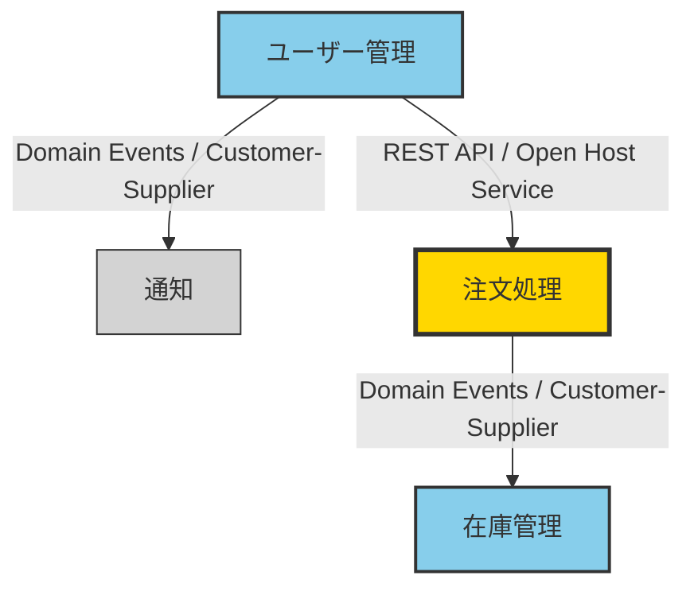

# ドメインモデル (Event Storming)

<!--
位置づけ（任意 / advanced テンプレート）:
  - MVP 標準フローのテンプレートではない。標準は軽量な Domain Sketch（01-domain-sketch.md、/a-004 が生成）。
  - 完全な Event Storming（Bounded Context / Commands / Events / Policies / Aggregates / Read Models /
    Context Map）が必要な複雑ドメインで、任意スキル /a-005-create-domain-diagram から使う。図化の自己目的化に注意。
  - 各要素の意味・付箋の色・CQRS / ACL などの解説は
    skills/a-004-define-domain-model/reference/event-storming-guide.md を参照。
-->

---

## Bounded Context: [コンテキスト名]

<!-- Bounded Context ごとにこの節を繰り返す。名前はユビキタス言語を使う（例: 注文処理 / 在庫管理）。 -->

### 概要

**戦略的分類**: <!-- Core（競争優位の中核）/ Supporting / Generic（既製品で代替可能） -->

**責務**: <!-- この Context が担うビジネス機能を 1〜2 文で -->

**主要な責任**:

- <!-- 責任1 -->
- <!-- 責任2 -->

### Actors（アクター）

<!-- コマンドを発行する人やシステム。この Context 内で行動するビジネス上の役割のみ。 -->

| アクター | 説明 |
|---------|------|
| <!-- 例: 管理者 --> | <!-- 例: システム設定を管理し、ユーザー権限を制御する --> |

### Commands（コマンド）

<!-- アクターが発行する指示。動詞・命令形（例: ユーザーを登録する）。必ず Domain Event をトリガーする。 -->

| コマンド | 発行者 | 説明 |
|---------|--------|------|
| <!-- 例: ユーザーを登録する --> | <!-- 例: エンドユーザー --> | <!-- 例: 新しいアカウントを作成する --> |

### Domain Events（ドメインイベント）

<!-- ビジネス上重要な出来事。過去形（例: ユーザー登録完了）。技術イベント（DB 保存）ではなくビジネスイベント。 -->

| ドメインイベント | トリガー（コマンド） | 説明 |
|-----------------|---------------------|------|
| <!-- 例: ユーザー登録完了 --> | <!-- 例: ユーザーを登録する --> | <!-- 例: 新規ユーザーが登録された --> |

### Policies（ポリシー）

<!-- 自動化ルール。「Whenever [イベント], then [コマンド]」形式。 -->

| ポリシー | 条件（Whenever） | アクション（Then） | 説明 |
|---------|-----------------|-------------------|------|
| <!-- 例: ウェルカムメール送信 --> | <!-- 例: ユーザー登録完了 --> | <!-- 例: ウェルカムメールを送信する --> | <!-- 例: 新規ユーザーへ自動送信 --> |

### Aggregates（集約）

<!-- 一貫性を保つエンティティの塊。1 集約 1 ルートエンティティ。トランザクション境界を定義する。 -->

| Aggregate | 責務 | 含まれるエンティティ |
|-----------|------|---------------------|
| <!-- 例: User --> | <!-- 例: 認証情報とプロフィールの整合性を保つ --> | <!-- 例: User, Profile, Credentials --> |

### Read Models（読み取りモデル）

<!-- UI 表示用の参照モデル（CQRS）。イベントから構築される最適化済みの読み取り専用構造。 -->

| Read Model | 表示データ | 利用者 |
|-----------|----------|--------|
| <!-- 例: ユーザープロフィール画面 --> | <!-- 例: 名前, メール, アバター, 登録日 --> | <!-- 例: エンドユーザー --> |

### External Systems（外部システム）

<!-- 連携する外部システム。連携方法と目的を記す。境界には Anticorruption Layer の要否を検討する。 -->

| 外部システム | 連携方法 | 目的 |
|------------|---------|------|
| <!-- 例: メール送信サービス --> | <!-- 例: REST API --> | <!-- 例: 通知メールの送信 --> |

---

## Context Map（コンテキスト間の関係図）

<!--
すべての Bounded Context 間の関係性を可視化する。
関係パターン（Customer-Supplier / Shared Kernel / Anticorruption Layer / Open Host Service など）と
通信方法をエッジラベルに記す。各パターンの意味は event-storming-guide.md を参照。
-->

## Context間の関係性一覧

<!-- Context Map 図を補足する詳細。 -->

| 上流Context | 下流Context | 関係パターン | 通信方法 | やり取りされるデータ |
|------------|------------|-------------|---------|-------------------|
| <!-- 例: ユーザー管理 --> | <!-- 例: 通知 --> | <!-- 例: Customer-Supplier --> | <!-- 例: Domain Events (Kafka) --> | <!-- 例: ユーザー登録完了イベント --> |

## メモ

<!-- 作成日・関与メンバー・次回レビュー・重要なアーキテクチャ決定・前提条件など。 -->
