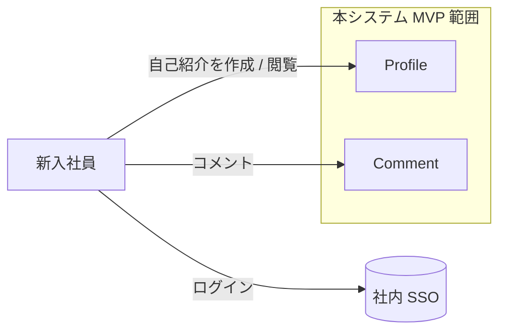

# Domain Sketch

<!--
何のドキュメントか: AI が責務混在を起こさない程度の軽量なドメイン理解を共有する資料。
                    完全な Event Storming / Bounded Context / Aggregate / Context Map ではない。
                    主要概念・境界・中核エンティティ・重要ルールだけを素早く固定する。

使い方:
  - 入力は Core Scenarios（02-behavior/01-core-scenarios.md）と MVP Scope（02-mvp-scope.md）。
  - 図を作ること自体を目的にしない。1 枚の簡易 Mermaid は任意。
  - 複雑なドメインで Full DDD（Bounded Context / Aggregate / Context Map）が必要になったら、
    任意で /a-005-create-domain-diagram（advanced）と 01-domain-model.md を使う。
-->

## 主要用語（10〜20 個）

<!--
何を書くか: このドメインで頻出する業務用語。曖昧語（Data / Process / Manager 等）は避ける。
            使用例・禁止用語まで含む詳細な用語集は 02-ubiquitous-language.md に委ねる。
-->

| 用語 | 意味（1 行） |
|---|---|
| <!-- 例: ライフラインチャート --> | <!-- 例: 入社者が経歴の浮き沈みを時系列で描く自己紹介 --> |

## アクター / 外部システム / システム境界

<!--
何を書くか: 誰がシステムを使い（アクター）、どの外部システムと連携し、システムの境界はどこか。
-->

- **アクター**: <!-- 例: 新入社員 / 受け入れチーム -->
- **外部システム**: <!-- 例: 社内 SSO(SAML) / 通知基盤 -->
- **システム境界（MVP で作る範囲）**: <!-- 例: プロフィール作成・閲覧・コメントまで -->

## 中核エンティティと責務

<!--
何を書くか: MVP の中核となるエンティティと、その 1 行責務。属性の網羅は不要。
-->

| エンティティ | 責務（1 行） |
|---|---|
| <!-- 例: Profile --> | <!-- 例: 入社者の自己紹介を保持し公開状態を管理する --> |

## 状態遷移（任意）

<!--
何を書くか: 重要なエンティティに明確なライフサイクルがある場合のみ記述（例: 下書き→公開→アーカイブ）。
            不要なら「該当なし」と記す。
-->

- <!-- 例: Profile: 下書き → 公開 → （退職時）アーカイブ -->

## 重要なビジネスルール

<!--
何を書くか: 守らないと価値や正しさが崩れるルールだけ。Core Scenarios の Critical Failure と整合させる。
-->

- <!-- 例: プロフィールの公開範囲は社内に限定される（社外公開不可）。 -->

## MVP では作らないドメイン範囲

<!--
何を書くか: 今回モデリングしない領域を明示する。02-mvp-scope.md の Not Now / Won't と整合させる。
-->

- <!-- 例: 人事評価・勤怠は対象外（既存システムが担う）。 -->

## 簡易ドメイン図（任意）

<!--
何を書くか: アクター・システム境界・外部システムを 1 枚で示す簡易図。任意。
            複雑な Context Map / Aggregate 図が必要なら /a-005（advanced）で作成する。
-->

